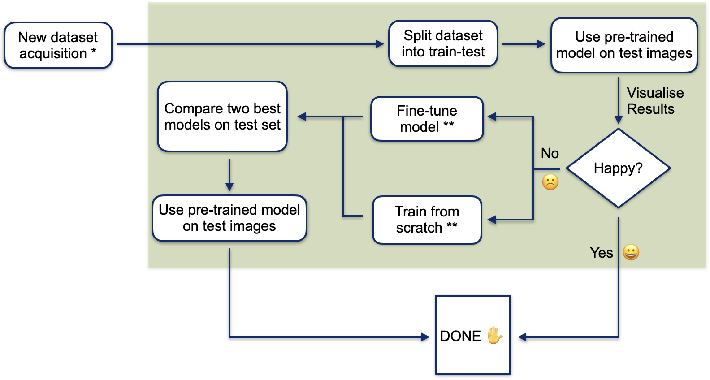

# Predicting infection from microscopy images of unlabelled cells


[](https://gitpod.io/#https://github.com/HelmholtzAI-Consultants-Munich/pytorch_fnet)


## What is this?
This branch has been forked from [release1](https://github.com/AllenCellModeling/pytorch_fnet/tree/release_1) which was then developed into a workflow for the generation of cell infection markers from brightfield microscopy images. The workflow is described in the image below.



## System Requirements
Installing on Linux is recommended (we have used Ubuntu 16.04).

An nVIDIA graphics card with >10GB of ram (we have used an nVIDIA Titan X Pascal) with current drivers installed (we have used nVIDIA driver version 390.48).

## Installation
- Install [Miniconda](https://conda.io/miniconda.html) if necessary.
- Open a shell, navigate to the directory in which this project is stored and execute the following:
   ```
   conda create -n fnet python=3.7
   conda activate fnet
   pip install -r requirements.txt
   conda install -c pytorch pytorch=1.8.0 torchvision=0.9.0 cuda91=1.0
   ```
   Type ```y``` in the terminal when prompted. This will create a conda environment and install the necessary packages to run the repo. If you do not have a GPU on your system (not advised for these kind of experiments) remove ```cuda91=1.0``` from the last line before executing it. You will also need to set ```config[gpu_ids]: -1``` (see config explanation below).

## How does this work?

Each time the user wishes to run the workflow, the environment previously installed will need to be activated. This can be done by opening a shell and typing:

```
conda activate fnet
```

The user can interact with the workflow through the ```config.yaml``` file. Within are included a list of parameters necessary for training and testing on a new dataset. For example, the batch size used during training of the network can be set to 32 by: ```batch_size: 32```.

For steps 1-2 of the workflow, the user must update the ```config``` file with her new data path (e.g. if the new dataset can be found under ```./data/acquisition_190821``` then  ```data_path: ./data``` and ```dataset: acquisition_190821``` need to be set) and any other parameter she wishes and then run the following:

```
python workflow_pt1.py
```

For steps 3-5 of the workflow, the user must run the following:

```
python workflow_pt2.py
```

## Step-to-step guide of infection workflow
 This workflow is aimed for use each time a new dataset is acquired. During acquisition of the new dataset the following **requirements** must be met: 

* The images of the new dataset need to be in .tiff format and 

* Each image must include at least three channels: the brightfield image, the DAPI and Cy3 images. (only brightfield channel needed if only the first part of the workflow is used to  predict infection from the pre-trained model). These channels are specified in the ```config``` by specifying the channel ID in ```signal_channel```, ```target_channel``` and ```dapi_channel``` (signal and target correspond to brightfield and Cy3, i.e. infection channel respectively).

The workflow is comprised of two main parts, testing and training:
 1. The new dataset is split into train and test sets
 2. To predict cell infection a model has been trained for 15000 iterations with 85 brightfield images and achieved a Pearson Correlation Coefficient of 0.81 on 15 test images. This pre-trained model is used to generate the infection channel for the images in the test set.
 3. At this point the user's input is required to visualize results and evaluate if the pre-trained model results are satisfactory. If so, the workflow ends here. The user can optionally use the model to produce infection images for the full dataset by setting ```train_size: 0``` in the ```config``` and rerunning ```workflow_pt1.py```.
 4. If the results are not satisfactory and the user is not happy the second part of the workflow needs to be implemented. Here, two training steps are performed:
 
    4.1. Fine-tune model: The training data is used to fine-tune the existing model (for this configuration, since the model has already been trained for 15000 iterations, ```config['training']['n_iter']``` needs to be set >15000, e.g. to train for an additional 1000 iteration the user must set ```config['training']['n_iter']: 16000``` in the ```config``` file)
 
    4.2. Train from scratch: The training data is used to train a new model from scratch. In both of these steps the following sub-workflow is implemented:
 
     - Apply k-fold cross validation on data (default: 5, can be changed in ```config```). For each fold:
 
         * Do hyperparameter search to find the best training configurations which maximize the Pearson Correlation Coefficient (default: 100 iterations, can be changed in ```config```)
 
         * Repeat hyperparameter search (default: 5 times, can be changed in ```config```)
 
    - Compute average of best hyperparameters (for folds and repeated runs)
 
    - Train a model with average best hyperparameters (without using a validation set)
  
 5. The two models from the previous step, as well as the pre-trained model are compared with respect to the Pearson Correlation Coefficient on the test set. The outputs of the best model are stored.

## Workflow outputs

The output path of the workflow can be specified in the ```config``` file be setting the ```output_path```. This will have the following structure:
├ └
```
|output_path: (e.g. ./outputs)
|  ├─ dataset (e.g. acquisition_190821)
|      ├─ pretrained
|         └─ results
|              └── ImgA_prediction.tif
|              └── ImgB_prediction.tif
|              └── pearson.json
|              └── predictions.csv
|      ├─ run (e.g. 2008211533)
|         ├─ fine_tuned
|            └── hyperaparams.csv  
|            └── train_options.json
|            └── ...
|            └── results
|                 └── ImgA_prediction.tif
|                 └── ...
|         ├─ train_from_scratch
|            └── loss.csv   
|            └── model.p
|            └── ...
|            └── results
|                 └── ImgA_prediction.tif
|                 └── ...
```

Under ```./outputs/acquisition_190821/pretrained/results``` the predicted images from the test set using the pretrained model will be stored, along with a file holding the Pearson Correlation Coefficient of each image, if the ground truth is available, and a file with the test data information. The same will be stored under ```./outputs/acquisition_190821/2008211533/fine_tuned/results``` and ```./outputs/acquisition_190821/2008211533/train_from_scratch/results``` for the fine-tuned and newly trained model alike. The direcotried ```./outputs/acquisition_190821/2008211533/fine_tuned```  and ```./outputs/acquisition_190821/2008211533/train_from_scratch``` will also hold various files relevant for training, such as training losses, a list of the best hyperparameters for each run, etc.

# Label-free prediction of three-dimensional fluorescence images from transmitted light microscopy


## Citation
If you find this code useful in your research, please consider citing our pre-publication manuscript:
```
@article{Ounkomol2018,
  author = {Chawin Ounkomol and Sharmishtaa Seshamani and Mary M. Maleckar and Forrest Collman and Gregory R. Johnson},
  title = {Label-free prediction of three-dimensional fluorescence images from transmitted-light microscopy},
  journal = {Nature Methods}
  doi = {10.1038/s41592-018-0111-2},
  url = {https://doi.org/10.1038/s41592-018-0111-2},
  year  = {2018},
  month = {sep},
  publisher = {Springer Nature America,  Inc},
  volume = {15},
  number = {11},
  pages = {917--920},
}
```

## Contact
Gregory Johnson  
E-mail: <gregj@alleninstitute.org>

## Allen Institute Software License
This software license is the 2-clause BSD license plus clause a third clause that prohibits redistribution and use for commercial purposes without further permission.   
Copyright © 2018. Allen Institute.  All rights reserved.

Redistribution and use in source and binary forms, with or without modification, are permitted provided that the following conditions are met:
1. Redistributions of source code must retain the above copyright notice, this list of conditions and the following disclaimer.  
2. Redistributions in binary form must reproduce the above copyright notice, this list of conditions and the following disclaimer in the documentation and/or other materials provided with the distribution.  
3. Redistributions and use for commercial purposes are not permitted without the Allen Institute’s written permission. For purposes of this license, commercial purposes are the incorporation of the Allen Institute's software into anything for which you will charge fees or other compensation or use of the software to perform a commercial service for a third party. Contact terms@alleninstitute.org for commercial licensing opportunities.  

THIS SOFTWARE IS PROVIDED BY THE COPYRIGHT HOLDERS AND CONTRIBUTORS "AS IS" AND ANY EXPRESS OR IMPLIED WARRANTIES, INCLUDING, BUT NOT LIMITED TO, THE IMPLIED WARRANTIES OF MERCHANTABILITY AND FITNESS FOR A PARTICULAR PURPOSE ARE DISCLAIMED. IN NO EVENT SHALL THE COPYRIGHT HOLDER OR CONTRIBUTORS BE LIABLE FOR ANY DIRECT, INDIRECT, INCIDENTAL, SPECIAL, EXEMPLARY, OR CONSEQUENTIAL DAMAGES (INCLUDING, BUT NOT LIMITED TO, PROCUREMENT OF SUBSTITUTE GOODS OR SERVICES; LOSS OF USE, DATA, OR PROFITS; OR BUSINESS INTERRUPTION) HOWEVER CAUSED AND ON ANY THEORY OF LIABILITY, WHETHER IN CONTRACT, STRICT LIABILITY, OR TORT (INCLUDING NEGLIGENCE OR OTHERWISE) ARISING IN ANY WAY OUT OF THE USE OF THIS SOFTWARE, EVEN IF ADVISED OF THE POSSIBILITY OF SUCH DAMAGE.
